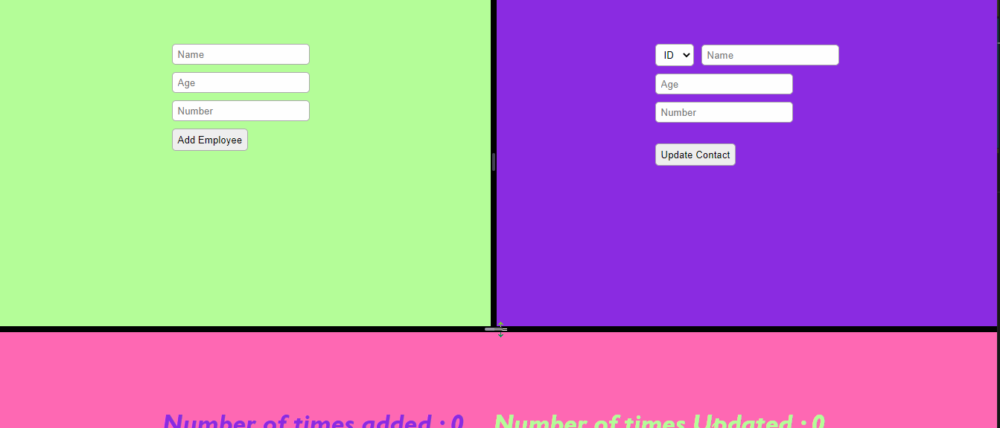

# Resizeable-app

==> First open server file -> use npm i to install all the node-modules -> the inside Model/DBOperatiions configure connection with your DB name, username and password
      -> then use nodemon start to get server up and running 
==> Then open Client file -> use npm o to install all the node-modules ->run npm start 
 
You can find the GIF attached below that show working of the app.    

